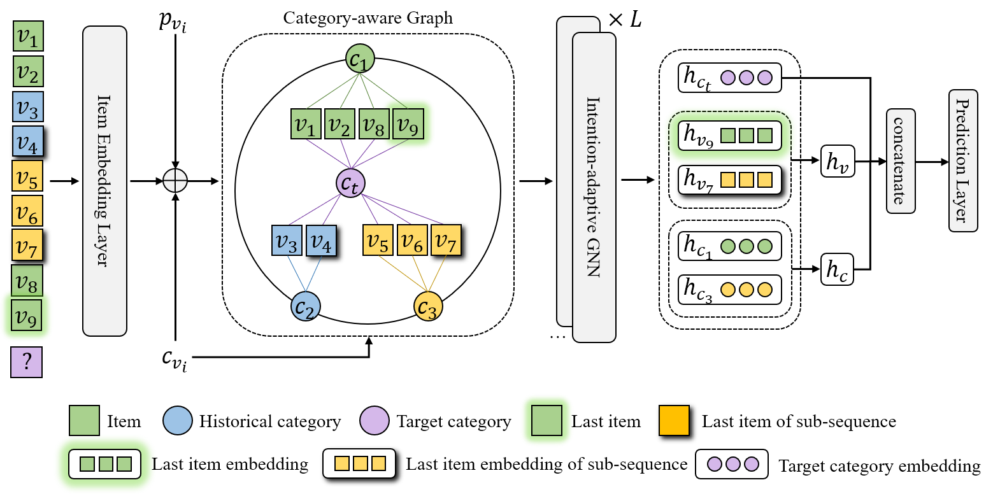

# Intention Adaptive Graph Neural Network (IAGNN)

This is the official repository of paper *Intention Adaptive Graph Neural Network for Category-Aware Session-Based Recommendation*.



If you found this work helpful, please kindly cite the paper as follows:

```bibtex
@article{cui2021intention,
  title={Intention Adaptive Graph Neural Network for Category-aware Session-based Recommendation},
  author={Cui, Chuan and Shen, Qi and Zhu, Shixuan and Pang, Yitong and Zhang, Yiming and Gao, Hanning and Wei, Zhihua},
  journal={arXiv preprint arXiv:2112.15352},
  year={2021}
}
```

## Prerequisite

Install the dependencies by `conda`

```bash
dgl~=0.6.0.post1
ipdb~=0.13.9
numpy~=1.21.2
pretty_errors~=1.2.24
PyMySQL~=1.0.2
scikit_learn~=1.0.2
torch~=1.8.1
TorchSnooper~=0.8
tqdm~=4.62.3
```

or by `pip`:

```bash
pip install -r requirements.txt
```

## How to train

```bash
# JData
python train.py --lr=0.003 --lr_step=2 --GL=3 --dataset=jdata_cd
# Yoochoose
python train.py --lr=0.001 --lr_step=1 --GL=1 --dataset=yc_BT_4
# Diginetica
python train.py --lr=0.003 --lr_step=1 --GL=2 --dataset=diginetica_x
```
